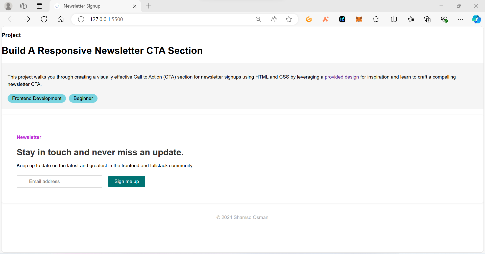

## My Responsive Newsletter Signup Section (Techstarta Project)

This project on Techstarta challenged me to build a visually appealing Call to Action (CTA) section to encourage visitors to subscribe to a website's newsletter. It was a great opportunity to practice my:

* **Basic HTML:** I learned how to structure web pages using elements like headings, paragraphs, forms, and buttons.
* **Introduction to CSS:** I styled the CTA section with CSS, controlling layout, fonts, colors, and more.

**What I Built:**

Following the project brief, I aimed to create a CTA section inspired by the provided image:

* **Clear and Concise CTA:** The section should be easy to understand and encourage visitors to subscribe.
* **Functional Signup Form:** I used HTML form elements to create a working signup form where users can enter their email addresses.
* **Visually Appealing Design:** Using CSS, I styled the CTA section to match the design elements from the inspirational image as closely as possible.
* **Optional Enticing Message:** While not required, I tried to include a brief message highlighting the projecr details.

**Deliverables:**

* **HTML & CSS Code:** I've included the code for my CTA section in this repository. It's well-commented and organized for easy understanding.
* **Functional CTA Section:** You can view the completed CTA section in `index.html` by opening it in a web browser.
* Here is a preview 
* Here is the [deployed link to the project]() 

**Challenges and Learnings:**

While building this CTA section, I encountered a few challenges:

* **Balancing Design and Functionality:** Sometimes, achieving a specific design element might require extra CSS code to ensure the form remains functional and user-friendly.
* **Responsiveness:**  I implemented media queries in CSS to make the CTA section responsive. This ensures the layout adapts to various screen sizes, like smartphones and tablets, for a better user experience on all devices. 

**Next Steps:**

* I'd love to get feedback on my design and how I can improve the user experience.
* Experimenting with different layouts and color schemes for the CTA section would be interesting.

I hope you find this project helpful! Feel free to use the code as a base for your own newsletter signup section.
